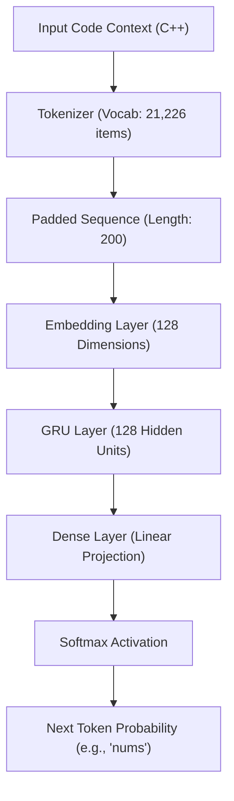

# CodePilot AI 🚀

CodePilot AI is a production-grade, deep learning-powered C++ code autocomplete and code generation platform. The application is powered by a custom Gated Recurrent Unit (GRU) neural network model trained on over 1,500+ LeetCode C++ solutions, wrapped in a high-performance FastAPI server and interactive React/Vite web interface.

---

## 🎨 Features
* **Real-time Autocomplete**: Predicts single next C++ keywords, symbols, or functions (argmax greedy prediction) with sub-10ms inference speeds.
* **Smart Code Generation**: Uses **top-k sampling** to generate long-form, structural code completions (e.g. C++ class members, methods, variables) from a starting prompt.
* **Interactive Monaco IDE Workspace**: Side-by-side editing panel featuring an embedded Monaco Editor, custom generation token sliders, and console logs.
* **Architecture Visualization**: Shows an animated step-by-step model pipeline tracing how raw input is tokenized, projected as vector embeddings, processed by the GRU layer, and projected through Softmax to yield predictions.
* **API Health Indicator**: Continuously polls the FastAPI backend `/health` endpoint to monitor online status and latency.

---

## 🧠 Model Architecture

The neural network is trained using TensorFlow/Keras with the following pipeline:



* **Vocab Size**: 21,226 tokens.
* **Embedding Depth**: 128 dimensions.
* **RNN Unit**: GRU with 128 hidden nodes.
* **Output Node**: Dense layer mapping to vocabulary with Softmax activation.

---

## 📂 Project Structure

```
CodePilot AI/
├── backend/
│   ├── app.py                # FastAPI initialization & middlewares
│   ├── config.py             # Configuration & path mappings
│   ├── requirements.txt      # Python package list
│   ├── routes/               # API endpoints (/health, /predict, /generate)
│   ├── schemas/              # Input/Output Pydantic schemas
│   ├── services/             # Model loading & inference logic
│   └── utils/                # Logging setup
├── frontend/
│   ├── index.html            # Web entry point & SEO header
│   ├── package.json          # Node dependencies
│   ├── vite.config.js        # Vite configs
│   └── src/
│       ├── main.jsx          # React renderer
│       ├── App.jsx           # App state router
│       ├── index.css         # Styling system
│       ├── components/       # UI elements (Navbar, ModelPipeline)
│       └── pages/            # Views (LandingPage, DashboardPage)
├── code_model.keras          # Pre-trained GRU model file
├── tokenizer (1).pkl         # Pre-trained Tokenizer pickle
├── database.csv              # LeetCode C++ training dataset
├── training.ipynb            # Jupyter training notebook
└── README.md                 # Project documentation
```

---

## 🔌 API Documentation

All routes are served directly from `http://localhost:8000`.

### `GET /health`
Verifies backend service, TensorFlow model status, and tokenizer state.

* **Response**:
  ```json
  {
    "status": "healthy",
    "model_loaded": true,
    "tokenizer_loaded": true,
    "max_sequence_length": 200
  }
  ```

### `POST /predict`
Executes single next-token autocomplete inference using greedy argmax.

* **Request**:
  ```json
  {
    "code": "vector<int>"
  }
  ```
* **Response**:
  ```json
  {
    "prediction": "nums"
  }
  ```

### `POST /generate`
Generates a sequence of tokens using top-k sampling (k=5).

* **Request**:
  ```json
  {
    "prompt": "vector<int>",
    "tokens": 50
  }
  ```
* **Response**:
  ```json
  {
    "generated_code": "vector<int> dfs(const grid) {\n int ans = 0;\n ..."
  }
  ```

---

## 🚀 Installation & Local Running

### Prerequisites
* Python 3.12 or 3.13
* Node.js (v18+ recommended) and npm

### 1. Run the Backend FastAPI Server
Open a terminal in the project root:

```bash
# Navigate to backend
cd backend

# Create virtual environment
python -m venv venv

# Activate virtual environment (Windows PowerShell)
.\venv\Scripts\Activate.ps1

# Install requirements
pip install -r requirements.txt

# Start the uvicorn server (port 8000)
uvicorn app:app --reload --host 127.0.0.1 --port 8000
```

### 2. Run the Frontend React Application
Open a new terminal in the project root:

```bash
# Navigate to frontend
cd frontend

# Install Node modules
npm install

# Start Vite local development server
npm run dev
```
Open `http://localhost:5173` in your browser.

---

## ☁️ Deployment Guide

### Backend Deployment (Docker + Render/AWS)
To deploy the FastAPI app in a containerized environment, create a `Dockerfile` under `backend/`:

```dockerfile
FROM python:3.11-slim
WORKDIR /app
COPY requirements.txt .
RUN pip install --no-cache-dir -r requirements.txt
COPY . .
EXPOSE 8000
CMD ["uvicorn", "app:app", "--host", "0.0.0.0", "--port", "8000"]
```

### Frontend Deployment (Vercel/Netlify)
The React application built with Vite compiles down to static assets:

```bash
cd frontend
npm run build
```
Deploy the resulting `dist/` directory to Vercel, Netlify, or AWS S3.

---

## 🔮 Future Improvements
1. **Transformer Transition**: Upgrade the sequence generation model to a decoder-only Transformer (like GPT-2 or Llama-based architecture) for cleaner context-understanding.
2. **Keyboard Shortcut Autocomplete**: Implement inline ghost text suggestions directly inside Monaco Editor, triggered on typing rather than clicking buttons.
3. **Advanced Sampling Options**: Support user sliders for temperature scaling and Nucleus (top-p) sampling values directly in the control panel.
